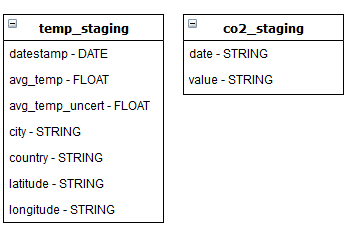
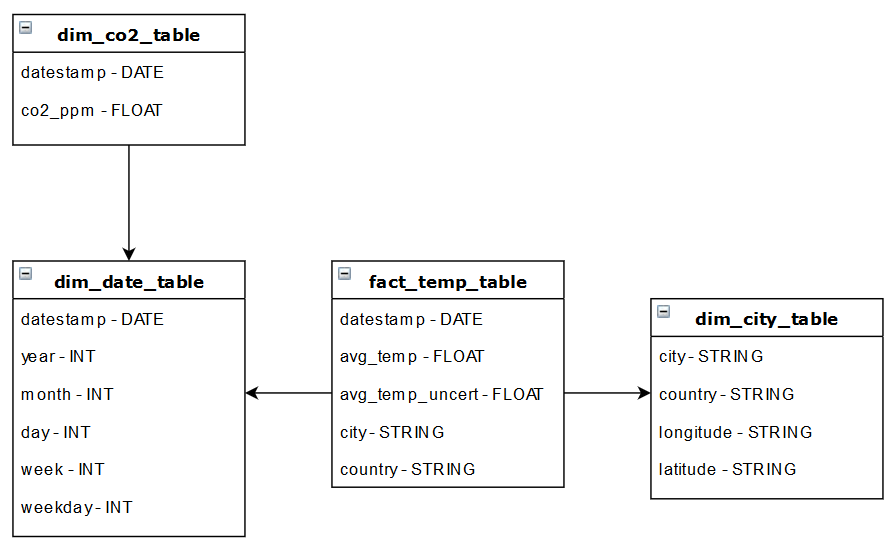

# Capstone Project: Historic Global Temperatures 
Final project for Udacity's Data Engineering Nanodegree  
23rd February 2020  
By Kyle McMillan

### Project Description
The purpose of the data engineering capstone project is to combine what has been learned throughout the data engineering program. This project will be an important part of the Data Engineering Nanodegree portfolio to help achieve data engineering-related career goals. In this project, I have chosen to complete the project provided by Udacity.

### Project files
This project contains seven files.
- `img/` Contains images used in this readme and the notebook.
- `co2_data/co2-ppm-daily_json` Contains the CO2 atmospheric data in JSON format.
- `temp_data/GlobalLandTemperaturesByCity.csv` Contains the global temperature data in CSV format.
- `Capstone Project.ipynd` Project walkthrough and description of the ETL process.
- `README.md` This file.
- `Data Dictionary.md` The data dictionary for this project.

### How to run
1. This project can all be run from the noebook file (CapstoneProject.ipynb)
    -This project will run from a local machine.

### Database and Tables
As the data for this project is intened to be used for analysis purposes, a snowflake schema will be used. Each table is stored in a separate folders as parquet files on the local machine.  

#### Staging tables
- `temp_staging` The original temperature data.
    - datestamp, avg_temp, avg_temp_uncert, city, country, longitude, latitude
- `co2_staging`  The original CO2 levels data.
    - date, value  
  
<small>Visual of the staging tables.</small>  

#### Fact table
- `fact_temp_table` All the temperature values for a city on a given date.
    - datestamp, avg_temp, avg_temp_uncert, city, country
    
#### Dimension Tables
- `dim_city_table` The cities in the database. 
    - city, country, longitude, latitude
- `dim_date_table`  The timestamp records split into specific units. 
    - datestamp, year, month, day, week, weekday
- `dim_co2_table` The CO2 values.
    - datestamp, co2_ppm      
  
<small>Visual of the final snowflake schema.</small>
